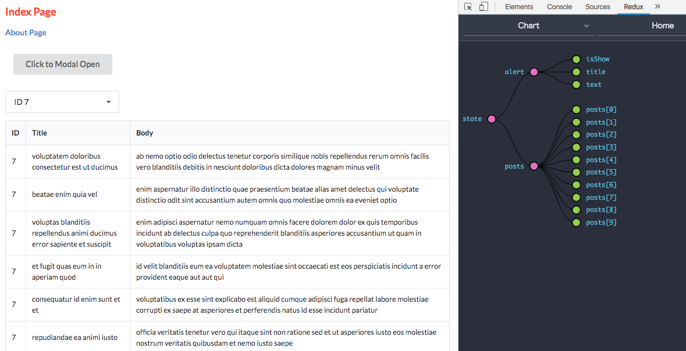

# Next-BFF-boilerplate

# Screenshot

Example URL: http://localhost:3000/?userId=7

(With query parameters)



Request API is https://jsonplaceholder.typicode.com/posts?userId=7

# Getting Started

```bash
# install dependencies
$ npm install

# serve with hot reload at localhost:3000
$ npm run dev

# build for Production and launch server
$ npm run build
$ npm start
```

# Development Command

|Command|Detail|
|---|---|
|`$ npm run lint`|Run ESLint|
|`$ npm run lint --fix`|Run Auto-Fix in ESLint|
|`$ npm run flow`|Run flowtype check|

## Pre-commit

The following commands are executed automatically when committed.

- flow check
- eslint --fix
